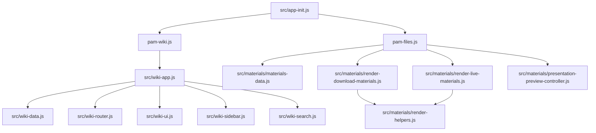
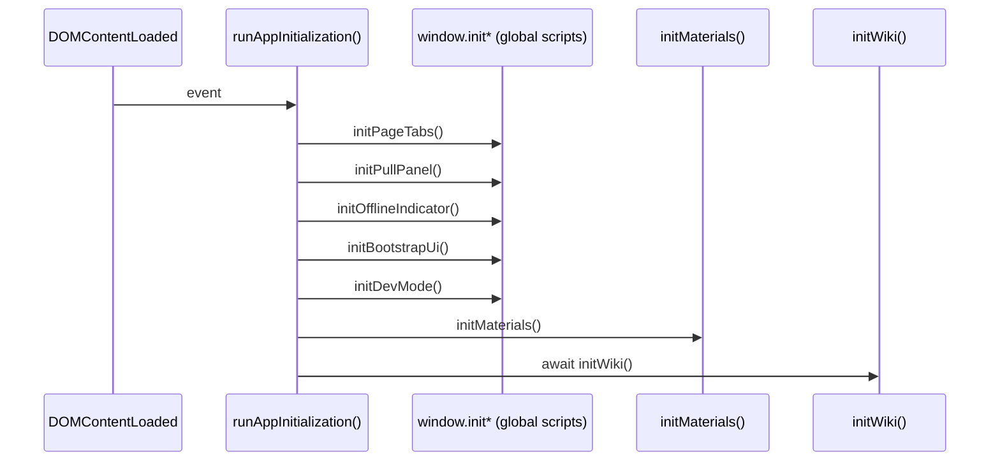

# Architektura frontendu (wiki + materials + dev-mode + UI bootstrap)

## Cel dokumentu

Ten dokument opisuje runtime frontendu PAM Wiki z perspektywy:

- modułów `wiki`, `materials`, `dev-mode`, `UI bootstrap`,
- zależności importów (ESM) i zależności globalnych (`window.*`),
- kolejności inicjalizacji (startup order),
- kontraktów wejścia/wyjścia głównych inicjalizatorów,
- zasad dodawania nowego modułu bez łamania startupu.

---

## 1) Moduły i ich odpowiedzialności

### A. `wiki`

**Główna rola:** obsługa renderowania artykułów, routingu hash (`#article-id`), panelu bocznego, wyszukiwania i UX artykułu.

**Kluczowe elementy:**

- `pam-wiki.js` — adapter wejściowy modułu wiki (`initWiki` deleguje do `initApp`).
- `src/wiki-app.js` — orkiestrator wiki (`initApp`), spina dane + UI + router.
- `src/wiki-data.js` — ładowanie i walidacja konfiguracji wiki do `WikiStore`.
- `src/wiki-router.js` — routing hash + aktywacja artykułu.
- `src/wiki-ui.js`, `src/wiki-sidebar.js`, `src/wiki-search.js` — render i zachowania UI.

**Kategoria architektoniczna:**

- `state`: `src/wiki-data.js` (`WikiStore`, `loadWikiConfig`).
- `controller`: `src/wiki-app.js`, `src/wiki-router.js`, `src/wiki-search.js`.
- `pure renderer`: części renderujące/sidebar/UI helpers, które budują DOM na podstawie danych (np. renderer sekcji/sidebar).

#### Mechanizm „zakładka ZAL dopiero za 3. razem”

Mechanizm jest celowo dwuetapowy: najpierw kontroluje **widoczność zakładki**, a potem dopiero **uruchomienie `zal.html`**.

1. **Aktywacja trybu dev** (`src/dev/dev-state.js`):
   - każde włączenie trybu dev wykonuje `activate()`,
   - `activate()` ustawia `pam-dev-mode='1'` i inkrementuje licznik `pam-dev-mode-activations`.
2. **Decyzja o pokazaniu zakładki ZAL** (`src/dev/dev-controller.js`):
   - po aktywacji liczony jest `activationCount`,
   - zakładka ZAL jest odsłaniana dopiero gdy `activationCount >= 3`,
   - wcześniej widoczna jest tylko zakładka `studenci`.
3. **Lazy uruchomienie iframe ZAL** (`index.html` + `src/dev/dev-panel-view.js`):
   - iframe ZAL startuje jako `src="about:blank"` i trzyma docelowy adres w `data-src="zal.html"`,
   - gdy kontroler pozwoli pokazać ZAL, `showDevTabs(true)` wywołuje `ensureZalIframeLoaded()`,
   - dopiero wtedy następuje podmiana `src` na `zal.html`, czyli realne uruchomienie modułu.
4. **Zachowanie po odświeżeniu strony**:
   - podczas `initDevMode()` odczytywany jest stan `pam-dev-mode` i licznik aktywacji,
   - jeśli dev mode był aktywny, UI odtwarza zakładki zgodnie z progiem `>= 3`,
   - dzięki temu aplikacja nie „zapomina” czy ZAL powinien być już dostępny.

---

### B. `materials`

**Główna rola:** render list materiałów (download/live), oraz kontroler podglądu PDF.

**Kluczowe elementy:**

- `pam-files.js` — adapter wejściowy (`initMaterials`).
- `src/materials/materials-data.js` — statyczne dane plików (`FILES_DATA`, `LIVE_MATERIALS_DATA`, mapy ikon).
- `src/materials/render-download-materials.js` — render listy plików do pobrania.
- `src/materials/render-live-materials.js` — render listy materiałów live.
- `src/materials/presentation-preview-controller.js` — kontroler podglądu PDF z przełączaniem trybu wykłady/laby.

**Kategoria architektoniczna:**

- `state`: `src/materials/materials-data.js`.
- `controller`: `pam-files.js`, `src/materials/presentation-preview-controller.js`.
- `pure renderer`: `src/materials/render-download-materials.js`, `src/materials/render-live-materials.js`, `src/materials/render-helpers.js`.

---

### C. `dev-mode`

**Główna rola:** ukryty tryb deweloperski aktywowany z poziomu ustawień, panel diagnostyczny, kontrola widoczności zakładek dev.

**Kluczowe elementy:**

- `dev-mode.js` — globalna funkcja `window.initDevMode`.

**Kategoria architektoniczna:**

- `state`: localStorage (`pam-dev-mode`, liczniki aktywacji).
- `controller`: `initDevMode` + funkcje aktywacji/deaktywacji.
- `pure renderer`: budowa panelu (`buildPanel`) i aktualizacja badge’y.

---

### D. `UI bootstrap`

**Główna rola:** inicjalizacja bazowego shella UI i modułów globalnych (tabs, pull panel, offline indicator, bootstrap kart/sekcji).

**Kluczowe elementy:**

- `src/page-tabs.js` — `window.initPageTabs`.
- `src/pull-panel.js` — `window.initPullPanel`.
- `src/offline-indicator.js` — `window.initOfflineIndicator`.
- `src/bootstrap-ui.js` — `window.initBootstrapUi` (w tym SW + dynamiczne sekcje UI).
- `src/app-init.js` — centralny startup orchestrator.

**Kategoria architektoniczna:**

- `controller`: `src/app-init.js` (kolejność init), moduły `init*` na `window`.
- `pure renderer`: część funkcji budujących statyczne/dynamiczne elementy interfejsu.
- `state`: flagi idempotencji na `window` (`__pam*Initialized`) + localStorage używany przez podmoduły.

---

## 2) Diagram zależności importów + runtime init order

## 2.1 Import graph (ESM)

## 2.2 Runtime startup order

**Uwaga praktyczna:** `app-init.js` wywołuje moduły UI przez `window.initX?.()` (optional chaining), więc brak konkretnego globala nie powinien zabić całego startupu — ale spowoduje brak funkcjonalności danego segmentu.

## 2.3 Startup: etapy krytyczne vs niekrytyczne + fallback

Aktualny startup w `src/app-init.js` jest podzielony na etapy:

- **Krytyczne (blokujące dalszy start):**
  - `ui:tabs` (`window.initPageTabs`)
  - `ui:pull-panel` (`window.initPullPanel`)
  - `ui:offline-indicator` (`window.initOfflineIndicator`)
  - `ui:bootstrap` (`window.initBootstrapUi`)
- **Niekrytyczne (błąd nie blokuje całej strony):**
  - `dev-mode` (`window.initDevMode`)
  - `materials` (`initMaterials`)
- **Asynchroniczny moduł krytyczny końcowy:**
  - `wiki` (`await initWiki`)

### Zasady obsługi błędów

1. Każdy etap startupu jest uruchamiany w osobnym `try/catch`.
2. Błąd jest logowany jawnie przez `console.error` z kontekstem etapu (`[app-init] Startup stage failed: <stage>`).
3. Dla etapów krytycznych (`ui:*` i `wiki`) renderowany jest **bezpieczny fallback UI** (`#app-service-fallback`) z komunikatem serwisowym i nazwą etapu, który się wyłożył.
4. Dla etapów niekrytycznych (`dev-mode`, `materials`) aplikacja kontynuuje działanie mimo błędu, ograniczając tylko funkcjonalność uszkodzonego modułu.

Ta strategia ogranicza „single point of failure” i poprawia odporność runtime’u frontendu.

---

## 3) Klasyfikacja modułów: renderer / controller / state

| Moduł | Typ główny | Uzasadnienie |
|---|---|---|
| `src/wiki-data.js` | **state** | Utrzymuje `WikiStore` i ładuje konfigurację wiki. |
| `src/wiki-router.js` | **controller** | Steruje nawigacją hash -> aktywny artykuł. |
| `src/wiki-app.js` | **controller** | Orkiestruje inicjalizację wiki end-to-end. |
| `src/wiki-sidebar.js` / render części wiki | **pure renderer** | Buduje drzewo DOM z danych wiki. |
| `src/materials/materials-data.js` | **state** | Źródło danych materiałów. |
| `src/materials/render-download-materials.js` | **pure renderer** | Renderuje listy plików bez zarządzania przepływem aplikacji. |
| `src/materials/render-live-materials.js` | **pure renderer** | Renderuje sekcje live. |
| `src/materials/presentation-preview-controller.js` | **controller** | Steruje podglądem i przełączaniem trybów. |
| `pam-files.js` | **controller** | Spina renderery i kontroler preview dla materials. |
| `dev-mode.js` | **controller + state-adapter** | Zarządza aktywacją, panelem i storage. |
| `src/app-init.js` | **controller (root orchestrator)** | Definiuje kolejność startupu całej aplikacji. |
| `src/bootstrap-ui.js` | **controller + renderer** | Inicjuje SW i tworzy część dynamicznego UI. |

---

## 4) Kontrakty wejścia/wyjścia kluczowych inicjalizatorów

## `runAppInitialization()` (`src/app-init.js`)

- **Wejście:** brak parametrów (opiera się o globalny DOM + globalne `window.init*`).
- **Wyjście:** `Promise<void>` (funkcja `async`).
- **Efekty uboczne:** wywołuje kolejne inicjalizatory UI/materials/wiki; zapisuje stan przez podmoduły.
- **Krytyczny kontrakt kolejności:** UI shell -> dev-mode -> materials -> wiki.

## `initWiki()` (`pam-wiki.js`)

- **Wejście:** brak.
- **Wyjście:** `Promise<void>`.
- **Efekt:** deleguje do `initApp()` z `src/wiki-app.js`.
- **Wymagania:** obecność kontenerów wiki i poprawny `pam-wiki-config.json`.

## `initApp()` (`src/wiki-app.js`)

- **Wejście:** brak (bierze dane i elementy z runtime).
- **Wyjście:** asynchroniczna inicjalizacja wiki (finalnie `Promise<void>`).
- **Efekty:**
  - ładuje konfigurację (`loadWikiConfig`),
  - ustawia router hash,
  - renderuje/aktywizuje artykuł,
  - podpina eventy UI i wyszukiwania.
- **Tryb błędu:** błędy fetch/konfiguracji wiki powinny być obsłużone w warstwie UI (komunikat/stan fallback).

## `initMaterials()` (`pam-files.js`)

- **Wejście:** brak (korzysta z importowanego `FILES_DATA` i DOM).
- **Wyjście:** `void`.
- **Efekty:**
  - render download + live,
  - podpina search,
  - uruchamia `initPresentationPreview(...)`.
- **Wymagania DOM:** kontenery `materials-content`, `materials-live-content`, elementy preview controls/frame.

## `initPresentationPreview(opts)` (`src/materials/presentation-preview-controller.js`)

- **Wejście:** obiekt:
  - `controlsId: string`,
  - `frameId: string`,
  - `openLinkId?: string`,
  - `data: Array` (struktura jak `FILES_DATA`).
- **Wyjście:** `void`.
- **Kontrakt defensywny:** jeżeli brakuje kluczowych elementów DOM lub danych, funkcja robi `return` bez wyjątku.
- **Efekty:** renderuje przyciski, ustawia `iframe.src`, aktualizuje link „otwórz w nowej karcie”.

## `initBootstrapUi()` (`src/bootstrap-ui.js`)

- **Wejście:** brak.
- **Wyjście:** `void`.
- **Idempotencja:** zabezpieczenie `window.__pamBootstrapUiInitialized`.
- **Efekty:** m.in. próba rejestracji Service Workera i inicjalizacja modułów UI bootstrap.

## `initDevMode()` (`dev-mode.js`)

- **Wejście:** brak.
- **Wyjście:** `void`.
- **Idempotencja:** `window.__pamDevModeInitialized`.
- **Efekty:** podpina aktywator, zarządza localStorage, może tworzyć panel overlay i modyfikować widoczność zakładek dev.

---

## 5) Jak dodać nowy moduł bez łamania startupu

## Krok 1: Określ typ modułu

Na starcie zdecyduj, czy moduł jest głównie:

- `state` (dane + walidacja),
- `pure renderer` (render z danych),
- `controller` (flow/eventy/orchestracja).

Ta decyzja wpływa na miejsce inicjalizacji i zależności.

## Krok 2: Zastosuj zasadę „defensive init”

Każdy `initX()` powinien:

1. Sprawdzić wymagane elementy DOM (`if (!el) return;`),
2. Sprawdzić wymagane dane,
3. Być idempotentny (np. `window.__pamXInitialized` albo `data-initialized`).

Dzięki temu brak jednego fragmentu strony nie wywraca całego startupu.

## Krok 3: Minimalny publiczny kontrakt inicjalizatora

Ustal i trzymaj prosty kontrakt:

- wejście: parametry jako pojedynczy obiekt (`initX({ ... })`) dla łatwej rozbudowy,
- wyjście: `void` dla sync, `Promise<void>` dla async,
- brak throw na brakującym DOM (zwróć `return`),
- throw tylko przy realnym błędzie danych/konfiguracji krytycznej.

## Krok 4: Integracja z `src/app-init.js`

Nowy moduł dopinaj zgodnie z zależnościami runtime:

1. Najpierw shell/UI, które tworzą kontenery,
2. potem moduły zależne od tych kontenerów,
3. na końcu moduły async/routingowe.

Praktycznie: jeśli moduł potrzebuje elementów z bootstrap UI, inicjalizuj go **po** `window.initBootstrapUi?.()`.

## Krok 5: Rozdziel import graph od global graph

- jeśli moduł może być ESM-only, importuj go normalnie (łatwiejsze śledzenie zależności),
- jeśli musi być globalny (legacy), wystaw tylko jedną funkcję `window.initX` i resztę trzymaj lokalnie.

Unikaj mieszania wielu globali — jeden punkt wejścia na moduł jest łatwiejszy do testowania.

## Krok 6: Checklista przed merge

- [ ] Startup działa bez błędów JS przy pustym hash i przy wejściu z hashem artykułu.
- [ ] `initX()` jest idempotentny.
- [ ] Brakujące elementy DOM nie powodują wyjątku.
- [ ] Zależności są dopięte we właściwej kolejności w `app-init.js`.
- [ ] Moduł ma jasno opisane: input/output/effects.

---

## 6) Szybkie podsumowanie architektury

- **Root controller:** `src/app-init.js`.
- **Wiki:** osobna ścieżka async (`initWiki`/`initApp`) z własnym store i routerem.
- **Materials:** inicjalizacja synchroniczna rendererów + kontrolera preview.
- **Dev-mode:** globalny kontroler diagnostyczny zależny od gotowego UI shell.
- **Stabilność startupu:** oparta na optional chaining, guard clauses i idempotentnych `init*`.
